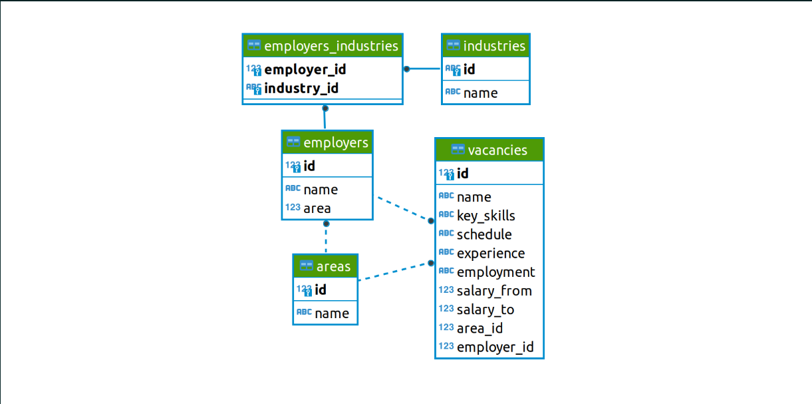
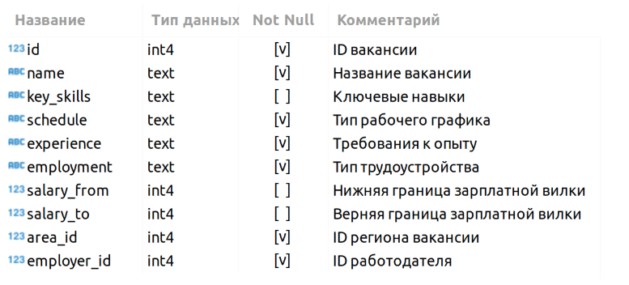

# Проект 2. Анализ вакансий из HeadHunter

## Постановка задачи

Предстоит решить часть настоящей бизнес-задачи и примерить роль аналитика в компании HeadHunter

## Описание задачи

Нужно представить, что мы устроились на работу в кадровое агентство, которое подбирает вакансии для IT-специалистов. Наш проект — создание модели машинного обучения, которая будет рекомендовать вакансии клиентам агентства, претендующим на позицию Data Scientist. Сначала нам необходимо понять, что из себя представляют данные и насколько они соответствуют целям проекта. В литературе эта часть работы над ML-проектом называется Data Understanding, или анализ данных.

## Организационная информация

Проект включает в себя несколько этапов:

1. знакомство с данными;
2. предварительный анализ данных;
3. детальный анализ вакансий;
4. анализ работодателей;
5. предметный анализ.

Каждая из частей будет состоять из блока практических заданий и контрольных вопросов на платформе.

## Требования к оформлению ноутбука-решения:

1. Решение оформляется только в Jupyter Notebook.
2. Решение оформляется в соответствии с ноутбуком-шаблоном.
3. Каждое задание выполняется в отдельной ячейке, выделенной под задание. Не следует создавать много ячеек для решения задачи — это провоцирует неудобства при проверке.
4. Текст SQL-запросов и код на Python должны быть читаемыми.
5. Выводы по каждому этапу оформляются в формате Markdown в отдельной ячейке.
6. Выводы можно дополнительно проиллюстрировать с помощью графиков. Они оформляются в соответствии с теми правилами, которые мы приводили в модуле по визуализации данных.
7. Удалить ячейку с данными соединения перед фиксацией работы в GitHub.

## Знакомство с данными

Все необходимые таблицы находятся в схеме public базы данных project_sql

Познакомимся с каждой таблицей.

### VACANCIES

Таблица хранит в себе данные по вакансиям и содержит следующие столбцы:

Зарплатная вилка — это верхняя и нижняя граница оплаты труда в рублях (зарплаты в других валютах уже переведены в рубли). Соискателям она показывает, в каком диапазоне компания готова платить сотруднику на этой должности.

### AREAS

Таблица-справочник, которая хранит код региона и его название.

### EMPLOYERS

Таблица-справочник со списком работодателей.

### INDUSTRIES

Таблица-справочник вариантов сфер деятельности работодателей.

### EMPLOYERS_INDUSTRIES

Дополнительная таблица, которая существует для организации связи между работодателями и сферами их деятельности.

Эта таблица нужна нам, поскольку у одного работодателя может быть несколько сфер деятельности (или работодатели могут вовсе не указать их). Для удобства анализа необходимо хранить запись по каждой сфере каждого работодателя в отдельной строке таблицы.

